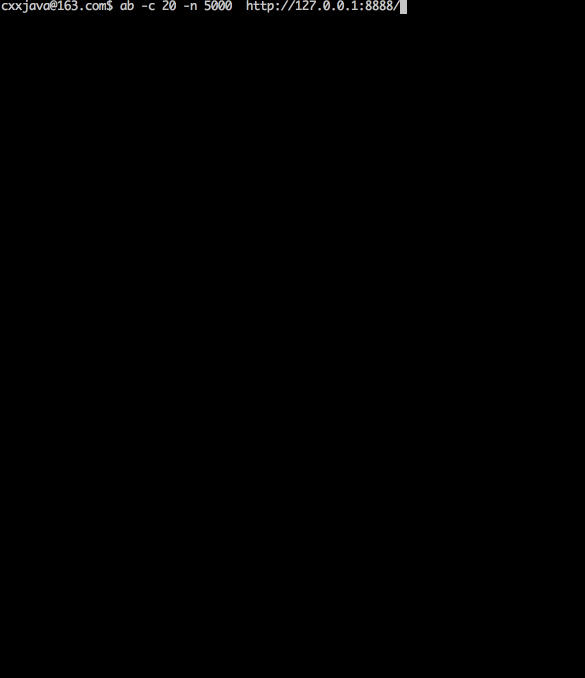

# CxxMina

## C++ network application framework like Mina2.0


chinese version: [简体中文](README.zh_cn.md)


### Table of Contents
- [Characteristics](#characteristics)
- [Example](#xxample)
- [Performance](#performance)
- [Dependency](#dependency)
- [TODO](#todo)
- [Support](#support)

#### Characteristics
* Cross platform: support Linux32/64, OSX64, Win64 platforms;
* High performance: with the advantages of C/C++ and Java concurrent Libraries tegother, bursting performance;
* Easy to develop: first, use the java development, and then use the `CxxJDK` for translation, So easy!
* Perfect copycat: Mina core got CxxMina also have, MINA core is no CxxMina also have!

#### Example
`java:`

```
private final static Logger logger = LoggerFactory.getLogger("testmina");
private static volatile boolean gRunning = true;

static class DemoIoHandler implements IoHandler {

	@Override
	public void sessionCreated(IoSession session) throws Exception {
		logger.trace("sessionCreated");
		session.getConfig().setIdleTime(IdleStatus.BOTH_IDLE, 1);
	}

	@Override
	public void sessionOpened(IoSession session) throws Exception {
		logger.trace("sessionOpened");
	}

	@Override
	public void sessionClosed(IoSession session) throws Exception {
		logger.trace("sessionClosed");
	}

	@Override
	public void sessionIdle(IoSession session, IdleStatus status)
			throws Exception {
		logger.trace("sessionIdle");
	}

	@Override
	public void exceptionCaught(IoSession session, Throwable cause)
			throws Exception {
		logger.trace("exceptionCaught");
		session.closeNow();
	}

	@Override
	public void messageReceived(IoSession session, Object message)
			throws Exception {
		
		// response.
		IoBuffer out = IoBuffer.allocate(100);
		out.buf().put("HTTP/1.1 200 OK\r\nContent-Length: 11\r\nContent-Type: text/html\r\n\r\nHello,world".getBytes());
		out.flip();
		session.write(out);
		
		// close
		session.closeOnFlush();
	}

	@Override
	public void messageSent(IoSession session, Object message)
			throws Exception {
		logger.trace("messageSent");
	}

	@Override
	public void inputClosed(IoSession session) throws Exception {
		logger.trace("inputClosed");
		session.closeNow();
	}
}

public static void main(String[] args) {
	try {
		NioSocketAcceptor nsa = new NioSocketAcceptor();
		LoggingFilter lf = new LoggingFilter();
		nsa.getFilterChain().addLast("logger", lf);
		nsa.getFilterChain().addLast("logger", lf);
		ProfilerTimerFilter pf = new ProfilerTimerFilter();
		nsa.getFilterChain().addLast("profile", pf);
		DemoIoHandler dih = new DemoIoHandler();
		nsa.setHandler(dih);
		InetSocketAddress isa = new InetSocketAddress(8888); //listen port.
		nsa.setReuseAddress(true);
		nsa.bind(isa);
		
		while (gRunning) {
			// do something.
			Thread.sleep(1000);
		}

		nsa.dispose(true);
	} catch (Throwable e) {
		e.printStackTrace();
	}
}
```


`c++:`

```
#include "Eio.hh"
#include "ELog.hh"

static sp<ELogger> logger = ELoggerManager::getLogger("testeio");
static volatile boolean gRunning = true;

class DemoIoHandler: public EIoHandler {
	void sessionCreated(sp<EIoSession>& session) THROWS(EException) {
		logger->trace("sessionCreated");
        session->getConfig()->setIdleTime(EIdleStatus::BOTH_IDLE, 1);
	}

	void sessionOpened(sp<EIoSession>& session) THROWS(EException) {
		logger->trace("sessionOpened");
	}

	void sessionClosed(sp<EIoSession>& session) THROWS(EException) {
		logger->trace("sessionClosed");
	}

	void sessionIdle(sp<EIoSession>& session, EIdleStatus status)
			THROWS(EException) {
		logger->trace("sessionIdle");
	}

	void exceptionCaught(sp<EIoSession>& session, sp<EThrowableType>& cause)
			THROWS(EException) {
		logger->trace("exceptionCaught");
		session->closeNow();
	}

	void messageReceived(sp<EIoSession>& session, sp<EObject>& message)
			THROWS(EException) {
		logger->trace("messageReceived, sessionid=%d", session->getId());

		// response.
		EIoBuffer *out = EIoBuffer::allocate(100);
		out->buf()->put("HTTP/1.1 200 OK\r\nContent-Length: 11\r\nContent-Type: text/html\r\n\r\nHello,world", 75);
		out->flip();
		session->write(out);

		// close
		session->closeOnFlush();
	}

	void messageSent(sp<EIoSession>& session, sp<EObject>& message)
			THROWS(EException) {
		logger->trace("messageSent");
	}
    
    void inputClosed(sp<EIoSession>& session) THROWS(EException) {
		logger->trace("inputClosed");
    	session->closeNow();
    }
};

int main(int argc, const char **argv) {
	// CxxJDK init.
    ESystem::init(argc, argv);
    // CxxLog4j init.
    ELoggerManager::init("log4e.properties");

	try {
		ENioSocketAcceptor *nsa = new ENioSocketAcceptor();
		ELoggingFilter* lf = new ELoggingFilter();
		nsa->getFilterChain()->addLast("logger", lf);
		EProfilerTimerFilter *ptf = new EProfilerTimerFilter();
		nsa->getFilterChain()->addLast("profile", ptf);
		DemoIoHandler* dih = new DemoIoHandler();
		nsa->setHandler(dih);
		EInetSocketAddress isa(8888); //listen port.
		nsa->setReuseAddress(true);
		nsa->bind(&isa);

		while (gRunning) {
			// do something.
			EThread::sleep(1000);
		}

		nsa->dispose(true);

		delete nsa;
		delete dih;
		delete lf;
		delete ptf;
	} catch (EThrowable& e) {
		e.printStackTrace();
	}
	
	ESystem::exit(0);

    return 0;
}
  
```

#### Performance

`software environment:`

```
@see c++ example code;

```

`hardware environment:`

```
Model Name:				MacBook Pro
Model Identifier:		MacBookPro10,2
Processor Speed:		2.6 GHz
Number of Processors:	1
Total Number of Cores:	2
```
`test results:`





#### Dependency
`CxxMina` is based on [CxxJDK](https://github.com/cxxjava/cxxjdk) && [CxxLog4j](https://github.com/cxxjava/cxxlog4j).


#### TODO
    More peripheral module;

#### Support
Email: [cxxjava@163.com](mailto:cxxjava@163.com)